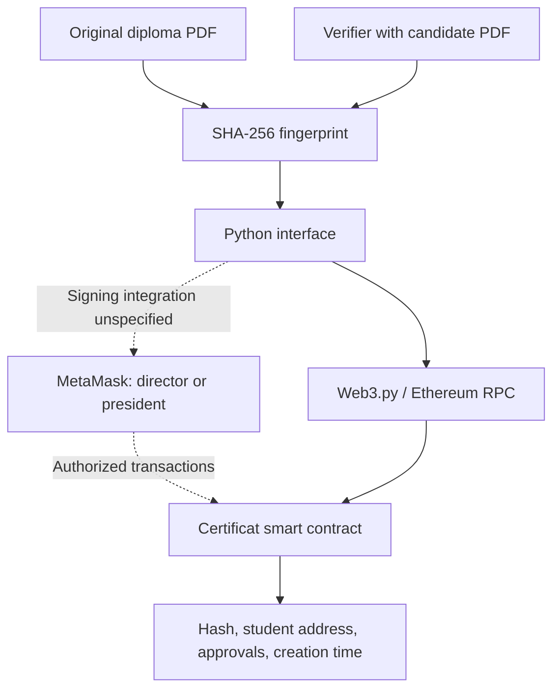

# Ethereum Certificate Verification

Academic certificate integrity and dual-authority approval using Ethereum smart contracts.

**Academic project · 2024–2025 · Blockchain module**  
**Authors: Rachid EL MAGROUA and Anas DARRAZ**

> Documentation portfolio. The original smart contract and Python application sources are currently unavailable. This repository documents the project from its presentation; it does not contain a runnable application or a verified deployment.

## Project overview

The project explores how an academic institution can register a diploma's SHA-256 fingerprint and require approval from two academic authorities before accepting it as validated. A student shares the original PDF, and a verifier recomputes its fingerprint to check the corresponding record.

This connects document integrity, role-based authorization and blockchain transaction workflows in one certificate lifecycle. Hash matching establishes correspondence with a registered document; trust also depends on the institution and its authorized signers.

## What the project covers

- Register a certificate hash and a student's Ethereum address.
- Record separate approvals from a director and a president.
- Accept a certificate only when both approval flags are true.
- Read approval status and the associated student address.
- Describe a Python interface communicating with the contract through Web3.py.

## Architecture

Conceptual architecture reconstructed from slides 10–21. The Python-to-MetaMask signing bridge is not specified in the available material.

## Certificate lifecycle

1. Compute SHA-256 over the original PDF bytes.
2. Register its hash and the student's address.
3. Obtain approvals from the director and president. The shown excerpts do not enforce an approval order.
4. Recompute the presented PDF's hash and query the contract.
5. Inspect both approvals and the trusted contract identity before interpreting the result.

## Technology described in the presentation

| Component | Role | Evidence status |
| --- | --- | --- |
| Solidity `^0.8.0` | Certificate data and approval logic | Partial excerpts in slides |
| Ethereum / Sepolia | Intended blockchain environment | No deployment address or transaction evidence supplied |
| SHA-256 | Fingerprint of PDF bytes | Workflow described |
| Python 3 / Web3.py | User interface and contract calls | Interface described; application source unavailable |
| MetaMask | Wallet and transaction signing | Integration described; bridge implementation unavailable |

## Explore the repository

| Path | Contents |
| --- | --- |
| [docs/design.md](docs/design.md) | Actors, data model and contract function map |
| [docs/review.md](docs/review.md) | Evidence boundaries and security observations |
| [docs/validation-plan.md](docs/validation-plan.md) | Proposed checks when the original code is recovered |
| [docs/provenance.md](docs/provenance.md) | Slide references and attribution |
| [contracts/README.md](contracts/README.md) | Smart contract source status |
| [app/README.md](app/README.md) | Application source status |

## Engineering observations

The presentation says only the director can create certificates, but its displayed creation function omits a caller check. This repository records that discrepancy rather than claiming the unavailable full contract resolves it. The approval functions do show role and existence checks.

No executable tests, deployment verification, measured performance results or security audit are included. The next milestone is to recover the original code and validate it against the [test plan](docs/validation-plan.md).

## Authors

- [Rachid EL MAGROUA](https://github.com/rachidelmagrouaIng)
- Anas DARRAZ

Original project title: *Certificat Numérique sur Blockchain Ethereum*.
