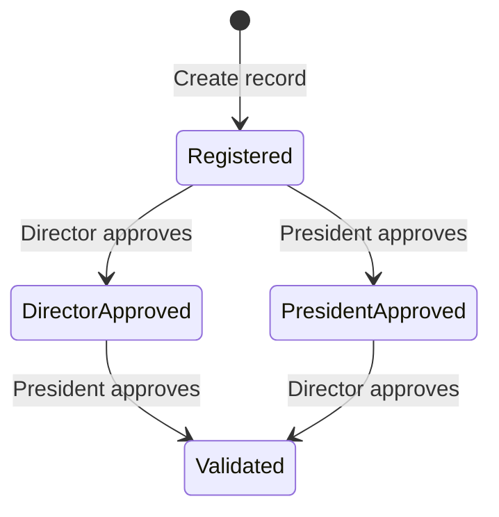

# System design

This document summarizes the presentation, not a recovered implementation.

## Actors

| Actor | Described responsibility |
| --- | --- |
| Director | Create certificate records and provide one approval |
| President | Provide the second approval |
| Student | Consult a certificate and share it for verification |
| Verifier | Hash the supplied PDF and check its approval status |

## Data model

Slide 14 presents the following fields in `Certif`:

| Field | Solidity type | Meaning |
| --- | --- | --- |
| `hashCertificat` | `string` | PDF SHA-256 fingerprint |
| `etudiant` | `address` | Associated student address |
| `signeParDirecteur` | `bool` | Director approval |
| `signeParPresident` | `bool` | President approval |
| `dateCreation` | `uint256` | Creation block timestamp |

The excerpts access records through `certificats[_hash]`. The full storage declaration and ABI are unavailable. The constructor excerpt assigns `directeur` and `president` addresses.

## Function map

| Function shown | Behavior in the excerpt |
| --- | --- |
| `creerCertificat(string,address)` | Rejects an existing creation timestamp, stores both approval flags as false |
| `signerParDirecteur(string)` | Requires director caller and existing record, sets director approval |
| `signerParPresident(string)` | Requires president caller and existing record, sets president approval |
| `verifierCertificat(string)` | Returns the conjunction of the two approval flags |
| `getEtatCertificat(string)` | Returns the approval pair |
| `verifierAccesEtudiant(string)` | Compares the stored student address with the caller |
| `getEtudiant(string)` | Returns the stored student address |

These are documentation signatures, not an ABI or compilable source release.

## Approval states

The presentation's narrative usually shows director first. Slide 16 explicitly states that no order is mandatory, and the excerpts check no prerequisite approval.

## Document handling

The described on-chain record stores a hash and metadata. PDF storage and distribution are not specified. IPFS and Layer 2 appear as future directions, not established components of this implementation.

The Python UI is described as including a creation form, role-aware dashboard, signing buttons and a verification view. No UI screenshot or executable application is available in the deck. A Web3.py RPC connection alone does not establish how MetaMask signing was integrated; that bridge remains undocumented.
